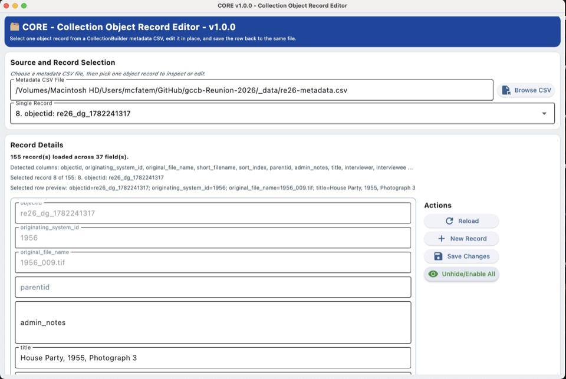

# CORE Quick Start Guide

CORE is a Flet app for selecting one object record from a CollectionBuilder metadata CSV, editing that single row, and saving the changes back to the file.

## UI Preview



## Start Here

```bash
cd /Users/mcfatem/GitHub/CORE
./run.sh
```

On Windows, run `scripts\\run.bat` from the project folder.

## Typical Workflow

1. Browse to the metadata CSV file.
2. Choose one record from the dropdown.
3. Edit the generated form fields for that record.
4. Click Save Changes to write the row back to the CSV.
5. CORE also creates a timestamped backup in `.CORE-working-directory` beside the CSV file.
6. Optionally define field behavior in `CORE-settings.json` (for example, `hidden`, `disabled`, or `disabled/boolean`).
7. Use **Unhide/Enable All** to toggle all fields visible/editable for the current session, and toggle it again to restore hidden/disabled behavior.

## What Gets Saved

CORE stores these local items in `~/CORE-data/`:

- the last metadata CSV file
- the last selected record index
- application logs

CORE also uses a working folder next to the CSV file:

- `.CORE-working-directory` for backup CSV files and temporary save files

Optional app-level field settings file:

- `CORE-settings.json` where keys are field names and values are characteristics
- Any field not listed is treated as editable visible text
- The **Unhide/Enable All** toggle is session-only and does not change `CORE-settings.json`

## Helpful Files

- [README.md](README.md) - application overview
- [app.py](app.py) - runtime logic
- [run.sh](run.sh) - root shortcut launcher
- [scripts/run.sh](scripts/run.sh) - macOS/Linux launcher
- [scripts/run.bat](scripts/run.bat) - Windows launcher

## Validation

```bash
python3 -m py_compile app.py
```